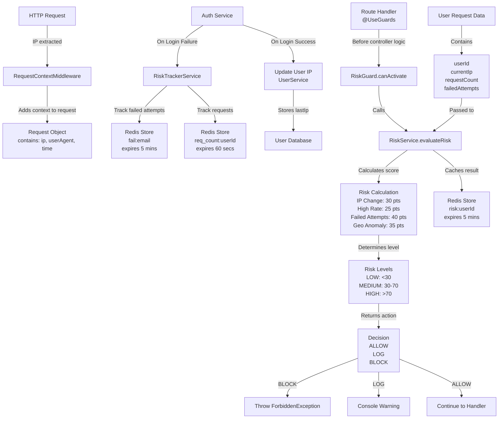

# Zero Trust Risk Engine Flow Diagram

## Description
This diagram represents the complete flow of the Zero Trust Security Engine risk evaluation system:

- Incoming requests pass through middleware for request context extraction.
- Authentication failures and request activity are tracked using Redis.
- RiskGuard intercepts protected routes before controller execution.
- RiskService evaluates request risk based on multiple factors.
- Risk scores determine whether the request is allowed, logged, or blocked.
- Redis caching improves performance for repeated evaluations.

